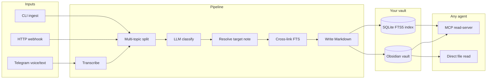

# Dendrite 🌿

<p align="center">
  <a href="https://github.com/mosesman831/dendrite/blob/main/LICENSE">
    
  </a>
  <a href="https://nodejs.org/">
    
  </a>
  <a href="https://github.com/mosesman831/dendrite/stargazers">
    
  </a>
  <a href="https://github.com/mosesman831/dendrite/issues">
    
  </a>
  <a href="https://github.com/mosesman831/dendrite">
    
  </a>
  <a href="https://obsidian.md/">
    
  </a>
</p>

<p align="center">
  <b>The knowledge ingestion daemon for Obsidian vaults.</b><br/>
  Capture anywhere. Classify automatically. Cross-link forever. Any agent can read your brain.
</p>

<p align="center">
  <a href="#quick-start">Quick Start</a> ·
  <a href="#why-dendrite-not-just-an-agent">Why Dendrite</a> ·
  <a href="DOCS.md">Docs</a> ·
  <a href="ROADMAP.md">Roadmap</a> ·
  <a href="#how-it-works">How It Works</a> ·
  <a href="#features">Features</a> ·
  <a href="#cli">CLI</a> ·
  <a href="#mcp-server">MCP</a> ·
  <a href="#architecture-spec">Docs</a>
</p>

---

You dump a thought — voice note on Telegram, text in CLI, webhook from Shortcuts.
Dendrite transcribes it, classifies it into the right **brain compartment**, finds
related notes you've written before, and writes clean Markdown with YAML
frontmatter and `[[wikilinks]]` into your Obsidian vault.

The vault is plain files. **Any** agent — Hermes, Cursor, Claude Code, a script —
can read it directly or over MCP and instantly know who you are, what you're
working on, and what you've already learned.

Dendrite is **not** another chatbot. It is infrastructure: an ingestion pipeline
on one side, a queryable second brain on the other.

## Why Dendrite (not just an agent)

Every AI agent today can *technically* remember things. In practice, they don't —
not reliably, not durably, not in a form you can audit or reuse.

| Problem with "just use an agent" | What Dendrite does instead |
|----------------------------------|----------------------------|
| **Memory is session-bound** — close the chat, lose the thread. | Writes **durable Markdown files** in your vault. Survives restarts, model swaps, and years. |
| **No filing discipline** — agents dump facts into chat or a single note. | **9 brain compartments** (`learnings`, `tasks`, `memories`, `journal`…) with LLM routing on every capture. |
| **No cross-linking** — agents don't connect today's thought to last month's. | **FTS5 + optional embeddings** find related notes and inject `[[wikilinks]]` automatically. |
| **One model, one interface** — you're locked to whatever app you're chatting in. | **Provider-agnostic** — NVIDIA NIM, OpenAI, Ollama, local gateways. Swap models in YAML. |
| **Agents can't ingest voice from your phone** — not without custom glue. | **Telegram bot** with voice transcription, inline corrections, `/sort`, `/undo`. |
| **Knowledge isn't portable** — it's trapped in conversation logs. | **Obsidian-native output** — Dataview-ready frontmatter, folders, tags. You own the files. |
| **Every agent starts from zero** — even if you told another agent yesterday. | **MCP read-server** — `search_vault`, `describe_schema`, `get_capture_siblings`. One brain, many consumers. |
| **Multi-topic dumps get lost** — "call plumber + TIL Rust + parents in Germany" becomes one blob. | **Multi-topic splitting** — one capture → multiple notes, sibling-linked, each in the right compartment. |

### The separation that matters

```
┌─────────────────────┐         ┌─────────────────────┐
│   DENDRITE          │         │   YOUR AGENT        │
│   (write side)      │         │   (read / reason)   │
│                     │         │                     │
│  ingest · classify  │  vault  │  search · plan ·    │
│  cross-link · file  │ ──────► │  code · answer      │
│                     │  .md    │                     │
└─────────────────────┘         └─────────────────────┘
```

**Dendrite captures and organizes.** Your agent thinks and acts. Neither tries to
do the other's job — so both do theirs well.

A normal agent asked "remember that my son goes to Riverside Academy" will say
"sure!" and maybe stuff it in a memory file you never see again. Dendrite writes
`brain/memories/son-attends-riverside-academy.md` with frontmatter, links it to
related family notes, indexes it for search, and makes it available to every
agent you run tomorrow.

### When you still want an agent

Use both. Dendrite is the **write path** for everything you learn, decide, and
need to recall. Agents are the **read/reason path** — they query the vault over
MCP or the filesystem and answer with full context. Tools like
[PolyBrain](https://github.com/mosesman831/PolyBrain) and
[PolyGnosis](https://github.com/mosesman831/PolyGnosis) orchestrate *reasoning*;
Dendrite orchestrates *remembering*.

## Quick Start

```bash
git clone https://github.com/mosesman831/dendrite.git
cd dendrite
npm install
npm run build

cp dendrite.config.example.yaml dendrite.config.yaml
cp .env.example .env          # add OPENAI_API_KEY and/or NVIDIA_API_KEY

npx dendrite doctor
npx dendrite ingest "TIL agent orchestration uses a DAG not a chain"
npx dendrite serve          # enable Telegram / webhook in config first
```

Or use the interactive wizard:

```bash
npx dendrite init
```

> **Beta (v0.1)** — vault schema and CLI may evolve. Pin a release tag for production use.

## How It Works



## Features

### Core pipeline

| Feature | Description |
|---------|-------------|
| **LLM classification** | Routes every dump to the right compartment with confidence tiers (silent / confirm / inbox). |
| **Multi-topic splitting** | One message with unrelated thoughts → multiple notes, sibling cross-linked. |
| **Laundry-list heuristic** | `"my son… and my daughter… and I like… and I have…"` → rule-split before classify. |
| **Near-duplicate merge** | FTS matching with title-relevance guard — won't append unrelated facts to the wrong note. |
| **Cross-linking** | Automatic `[[wikilinks]]` to related vault notes on every capture. |
| **Correction loop** | Telegram inline keyboard corrections feed few-shot examples into future classifications. |
| **Idempotent ingest** | Same `dump.id` twice → no-op. Safe for webhook retries. |
| **Soft undo** | `dendrite remove --last` or Telegram `/undo` — section remove or move to inbox. |
| **Per-compartment templates** | Optional `templates/<compartment>.md` customize frontmatter + body of newly created notes. |

### Inputs

| Channel | Description |
|---------|-------------|
| **Telegram** | Text + voice, `/sort` preview, `/undo`, `/inbox`, inline corrections. |
| **HTTP webhook** | `POST /ingest` for Shortcuts, IFTTT, custom scripts. Bearer auth. |
| **CLI** | `dendrite ingest "..."` and `dendrite ingest --file note.ogg`. |
| **Daily prompt** | Optional cron — "What did you learn today?" via Telegram. |

### Vault maintenance

| Command | Description |
|---------|-------------|
| `dendrite sort` | LLM-sort inbox + unfiled imports into `brain/` compartments. |
| `dendrite repair` | Detect junk-drawer notes (many unrelated sections) and re-file. |
| `dendrite migrate` | Upgrade note frontmatter to current `dendrite_version`. |
| `dendrite embed` | Build embedding vectors for hybrid semantic search. |
| `dendrite backfill` | Classify vault-root / scratch notes into brain folders. |
| `dendrite ask` | RAG question-answering over the vault, with `[[wikilink]]` citations. |
| `dendrite eval` | Run a golden labeled dataset through the classifier to measure routing accuracy. |

### Agent interface (MCP)

| Tool | Description |
|------|-------------|
| `describe_schema` | Compartments + frontmatter contract — call this first. |
| `search_vault` | Keyword + hybrid semantic search over the index. |
| `answer_question` | RAG answer from your vault with `[[wikilink]]` citations. |
| `read_note` | Read any note by vault-relative path. |
| `vault_catalog` | Full index snapshot grouped by compartment. |
| `get_capture_siblings` | Reconstruct a multi-segment capture by `split_group`. |
| `get_backlinks` | Notes that link to a given path. |
| `recent_notes` | Recently updated notes, filterable by compartment. |
| `list_compartments` | Compartment list with note counts. |

## CLI

```
dendrite init              # interactive setup wizard
dendrite doctor [--stats]  # health check + local metrics
dendrite ingest "text"     # classify + write
dendrite ingest --dry-run  # preview without writing
dendrite ask "question"    # RAG answer from your vault, with citations
dendrite eval              # classification accuracy on a golden dataset
dendrite serve             # daemon: telegram + webhook + crons
dendrite mcp               # MCP read-server (stdio)
dendrite reindex           # rebuild SQLite index from vault
dendrite inbox             # list unfiled items
dendrite sort [--dry-run]  # LLM-sort inbox + imports
dendrite repair [--dry-run]# split junk-drawer notes
dendrite migrate [--dry-run]
dendrite embed [--force]   # build semantic vectors
dendrite remove --last     # undo last capture
dendrite backfill          # classify vault-root imports only
dendrite pattern-scan      # weekly digest now
```

Telegram: `/help` `/inbox` `/recent` `/compartments` `/ask` `/sort` `/undo`

## Configuration

Copy `dendrite.config.example.yaml` → `dendrite.config.yaml`. All providers are
OpenAI-compatible — swap NVIDIA NIM, OpenAI, Groq, or Ollama in one edit.

```yaml
providers:
  llm:
    primary:
      baseURL: https://integrate.api.nvidia.com/v1
      model: meta/llama-3.1-8b-instruct
      apiKeyEnv: NVIDIA_API_KEY
    fallback:
      baseURL: https://api.openai.com/v1
      model: gpt-4o-mini
      apiKeyEnv: OPENAI_API_KEY
  stt:
    provider: openai-audio    # or nvidia-riva-grpc, whisper-cpp
    baseURL: https://api.openai.com/v1
    model: whisper-1
    apiKeyEnv: OPENAI_API_KEY

inputs:
  telegram:
    enabled: false
    tokenEnv: TELEGRAM_BOT_TOKEN
    allowed_user_ids: []      # your Telegram user ID
```

See [`provider-presets.yaml`](provider-presets.yaml) for more copy-paste examples.

### Brain compartments

Defined in [`compartments.yaml`](compartments.yaml):

| Compartment | Purpose |
|-------------|---------|
| `learnings` | Facts, techniques, TILs |
| `projects` | Per-project knowledge (subdivided by entity) |
| `memories` | Durable personal facts — people, places, preferences |
| `tasks` | Things to do, follow-ups |
| `ideas` | Unformed thoughts, product ideas |
| `reads` | Books, articles, resources |
| `reflections` | People dynamics, growth insights |
| `journal` | Ephemeral daily logs (append-only) |
| `inbox` | Low-confidence / awaiting triage |

## MCP Server

Register in Cursor, Claude Code, or Hermes:

```json
{
  "mcpServers": {
    "dendrite": {
      "command": "node",
      "args": ["/absolute/path/to/dendrite/dist/cli.js", "mcp"]
    }
  }
}
```

**Agents:** see [AGENTS.md](AGENTS.md) for tool usage, pipeline rules, and contribution guidance.

## Vault output

Every capture becomes a Markdown note with Dataview-friendly YAML:

```yaml
---
compartment: learnings
title: Agent orchestration uses DAG not chain
confidence: 0.91
entities: [agent orchestration, DAG]
tags: [til]
links: ["[[related-note]]"]
dendrite_version: 1
summary: Technical learning about orchestration patterns.
---
```

Body sections are timestamped: `## 2026-07-07 14:30 · via telegram-voice`

## Docker

```bash
docker compose up
```

Mount your vault at `/vault` and set env vars in `.env`.

## File Tree

```text
dendrite/
├── README.md                    # This file
├── DOCS.md                      # Usage guide
├── ROADMAP.md                   # Future plans
├── AGENTS.md                    # Guide for AI agents
├── CHANGELOG.md
├── dendrite.config.example.yaml
├── compartments.yaml            # Brain compartment definitions
├── src/
│   ├── cli.ts                   # CLI entrypoint
│   ├── pipeline/                # classify → resolve → crosslink → write
│   ├── inputs/                  # telegram, webhook, crons
│   ├── mcp/server.ts            # MCP read-server
│   └── commands/                # sort, repair, migrate, embed, …
├── scripts/thorough-test.mjs    # Integration test suite (npm test)
├── vault/                       # Starter example vault
└── .github/workflows/ci.yml
```

## Documentation

- [**DOCS.md**](DOCS.md) — full usage guide
- [**ROADMAP.md**](ROADMAP.md) — future plans

## Testing

```bash
npm run build
npm test        # 31 integration checks (requires API keys in .env)
```

Set `TEST_AUDIO=1` to include optional STT tests.

## Related projects

> If you liked this project, you may like [LatticeAG](https://github.com/LatticeAG) - an agentic AI lab to improve agent-use

## License

MIT — see [LICENSE](LICENSE).
