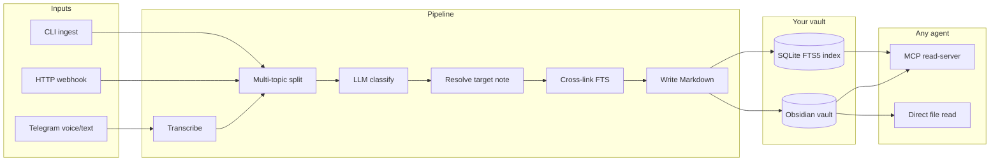

# Dendrite 🌿

<p align="center">
  <a href="https://github.com/mosesman831/dendrite/blob/main/LICENSE">
    
  </a>
  <a href="https://nodejs.org/">
    
  </a>
  <a href="https://github.com/mosesman831/dendrite/stargazers">
    
  </a>
  <a href="https://github.com/mosesman831/dendrite/issues">
    
  </a>
  <a href="https://github.com/mosesman831/dendrite">
    
  </a>
  <a href="https://obsidian.md/">
    
  </a>
</p>

<p align="center">
  <b>The knowledge ingestion daemon for Obsidian vaults.</b><br/>
  Capture anywhere. Classify automatically. Cross-link forever. Any agent can read your brain.
</p>

<p align="center">
  <a href="#quick-start">Quick Start</a> ·
  <a href="#why-dendrite-not-just-an-agent">Why Dendrite</a> ·
  <a href="DOCS.md">Docs</a> ·
  <a href="ROADMAP.md">Roadmap</a> ·
  <a href="#how-it-works">How It Works</a> ·
  <a href="#features">Features</a> ·
  <a href="#cli">CLI</a> ·
  <a href="#mcp-server">MCP</a> ·
  <a href="#architecture-spec">Docs</a>
</p>

---

You dump a thought — voice note on Telegram, text in CLI, webhook from Shortcuts.
Dendrite transcribes it, classifies it into the right **brain compartment**, finds
related notes you've written before, and writes clean Markdown with YAML
frontmatter and `[[wikilinks]]` into your Obsidian vault.

The vault is plain files. **Any** agent — Hermes, Cursor, Claude Code, a script —
can read it directly or over MCP and instantly know who you are, what you're
working on, and what you've already learned.

Dendrite is **not** another chatbot. It is infrastructure: an ingestion pipeline
on one side, a queryable second brain on the other.

## Why Dendrite (not just an agent)

Every AI agent today can *technically* remember things. In practice, they don't —
not reliably, not durably, not in a form you can audit or reuse.

| Problem with "just use an agent" | What Dendrite does instead |
|----------------------------------|----------------------------|
| **Memory is session-bound** — close the chat, lose the thread. | Writes **durable Markdown files** in your vault. Survives restarts, model swaps, and years. |
| **No filing discipline** — agents dump facts into chat or a single note. | **9 brain compartments** (`learnings`, `tasks`, `memories`, `journal`…) with LLM routing on every capture. |
| **No cross-linking** — agents don't connect today's thought to last month's. | **FTS5 + optional embeddings** find related notes and inject `[[wikilinks]]` automatically. |
| **One model, one interface** — you're locked to whatever app you're chatting in. | **Provider-agnostic** — NVIDIA NIM, OpenAI, Ollama, local gateways. Swap models in YAML. |
| **Agents can't ingest voice from your phone** — not without custom glue. | **Telegram bot** with voice transcription, inline corrections, `/sort`, `/undo`. |
| **Knowledge isn't portable** — it's trapped in conversation logs. | **Obsidian-native output** — Dataview-ready frontmatter, folders, tags. You own the files. |
| **Every agent starts from zero** — even if you told another agent yesterday. | **MCP read-server** — `search_vault`, `describe_schema`, `get_capture_siblings`. One brain, many consumers. |
| **Multi-topic dumps get lost** — "call plumber + TIL Rust + parents in Germany" becomes one blob. | **Multi-topic splitting** — one capture → multiple notes, sibling-linked, each in the right compartment. |

### The separation that matters

```
┌─────────────────────┐         ┌─────────────────────┐
│   DENDRITE          │         │   YOUR AGENT        │
│   (write side)      │         │   (read / reason)   │
│                     │         │                     │
│  ingest · classify  │  vault  │  search · plan ·    │
│  cross-link · file  │ ──────► │  code · answer      │
│                     │  .md    │                     │
└─────────────────────┘         └─────────────────────┘
```

**Dendrite captures and organizes.** Your agent thinks and acts. Neither tries to
do the other's job — so both do theirs well.

A normal agent asked "remember that my son goes to Riverside Academy" will say
"sure!" and maybe stuff it in a memory file you never see again. Dendrite writes
`brain/memories/son-attends-riverside-academy.md` with frontmatter, links it to
related family notes, indexes it for search, and makes it available to every
agent you run tomorrow.

### When you still want an agent

Use both. Dendrite is the **write path** for everything you learn, decide, and
need to recall. Agents are the **read/reason path** — they query the vault over
MCP or the filesystem and answer with full context. Tools like
[PolyBrain](https://github.com/mosesman831/PolyBrain) and
[PolyGnosis](https://github.com/mosesman831/PolyGnosis) orchestrate *reasoning*;
Dendrite orchestrates *remembering*.

## Quick Start

```bash
git clone https://github.com/mosesman831/dendrite.git
cd dendrite
npm install
npm run build

cp dendrite.config.example.yaml dendrite.config.yaml
cp .env.example .env          # add OPENAI_API_KEY and/or NVIDIA_API_KEY

npx dendrite doctor
npx dendrite ingest "TIL agent orchestration uses a DAG not a chain"
npx dendrite serve          # enable Telegram / webhook in config first
```

Or use the interactive wizard:

```bash
npx dendrite init
```

> **Beta (v0.1)** — vault schema and CLI may evolve. Pin a release tag for production use.

## How It Works


```mermaid
flowchart LR
  subgraph inputs [Inputs]
    TG[Telegram voice/text]
    WH[HTTP webhook]
    CLI[CLI ingest]
  end

  subgraph pipeline [Pipeline]
    STT[Transcribe]
    SPLIT[Multi-topic split]
    CLS[LLM classify]
    RES[Resolve target note]
    XLINK[Cross-link FTS]
    WRT[Write Markdown]
  end

  subgraph storage [Your vault]
    VAULT[(Obsidian vault)]
    IDX[(SQLite FTS5 index)]
  end

  subgraph agents [Any agent]
    MCP[MCP read-server]
    FS[Direct file read]
  end

  TG --> STT --> SPLIT --> CLS --> RES --> XLINK --> WRT
  WH --> SPLIT
  CLI --> SPLIT
  WRT --> VAULT
  WRT --> IDX
  VAULT --> MCP
  VAULT --> FS
  IDX --> MCP
```

## Features

### Core pipeline

| Feature | Description |
|---------|-------------|
| **LLM classification** | Routes every dump to the right compartment with confidence tiers (silent / confirm / inbox). |
| **Multi-topic splitting** | One message with unrelated thoughts → multiple notes, sibling cross-linked. |
| **Laundry-list heuristic** | `"my son… and my daughter… and I like… and I have…"` → rule-split before classify. |
| **Near-duplicate merge** | FTS matching with title-relevance guard — won't append unrelated facts to the wrong note. |
| **Cross-linking** | Automatic `[[wikilinks]]` to related vault notes on every capture. |
| **Correction loop** | Telegram inline keyboard corrections feed few-shot examples into future classifications. |
| **Idempotent ingest** | Same `dump.id` twice → no-op. Safe for webhook retries. |
| **Soft undo** | `dendrite remove --last` or Telegram `/undo` — section remove or move to inbox. |
| **Per-compartment templates** | Optional `templates/<compartment>.md` customize frontmatter + body of newly created notes. |

### Inputs

| Channel | Description |
|---------|-------------|
| **Telegram** | Text + voice, `/sort` preview, `/undo`, `/inbox`, inline corrections. |
| **HTTP webhook** | `POST /ingest` for Shortcuts, IFTTT, custom scripts. Bearer auth. |
| **CLI** | `dendrite ingest "..."` and `dendrite ingest --file note.ogg`. |
| **Daily prompt** | Optional cron — "What did you learn today?" via Telegram. |

### Vault maintenance

| Command | Description |
|---------|-------------|
| `dendrite sort` | LLM-sort inbox + unfiled imports into `brain/` compartments. |
| `dendrite repair` | Detect junk-drawer notes (many unrelated sections) and re-file. |
| `dendrite migrate` | Upgrade note frontmatter to current `dendrite_version`. |
| `dendrite embed` | Build embedding vectors for hybrid semantic search. |
| `dendrite backfill` | Classify vault-root / scratch notes into brain folders. |
| `dendrite ask` | RAG question-answering over the vault, with `[[wikilink]]` citations. |
| `dendrite eval` | Run a golden labeled dataset through the classifier to measure routing accuracy. |

### Agent interface (MCP)

| Tool | Description |
|------|-------------|
| `describe_schema` | Compartments + frontmatter contract — call this first. |
| `search_vault` | Keyword + hybrid semantic search over the index. |
| `answer_question` | RAG answer from your vault with `[[wikilink]]` citations. |
| `read_note` | Read any note by vault-relative path. |
| `vault_catalog` | Full index snapshot grouped by compartment. |
| `get_capture_siblings` | Reconstruct a multi-segment capture by `split_group`. |
| `get_backlinks` | Notes that link to a given path. |
| `recent_notes` | Recently updated notes, filterable by compartment. |
| `list_compartments` | Compartment list with note counts. |

## CLI

```
dendrite init              # interactive setup wizard
dendrite doctor [--stats]  # health check + local metrics
dendrite ingest "text"     # classify + write
dendrite ingest --dry-run  # preview without writing
dendrite ask "question"    # RAG answer from your vault, with citations
dendrite eval              # classification accuracy on a golden dataset
dendrite serve             # daemon: telegram + webhook + crons
dendrite mcp               # MCP read-server (stdio)
dendrite reindex           # rebuild SQLite index from vault
dendrite inbox             # list unfiled items
dendrite sort [--dry-run]  # LLM-sort inbox + imports
dendrite repair [--dry-run]# split junk-drawer notes
dendrite migrate [--dry-run]
dendrite embed [--force]   # build semantic vectors
dendrite remove --last     # undo last capture
dendrite backfill          # classify vault-root imports only
dendrite pattern-scan      # weekly digest now
```

Telegram: `/help` `/inbox` `/recent` `/compartments` `/ask` `/sort` `/undo`

## Configuration

Copy `dendrite.config.example.yaml` → `dendrite.config.yaml`. All providers are
OpenAI-compatible — swap NVIDIA NIM, OpenAI, Groq, or Ollama in one edit.

```yaml
providers:
  llm:
    primary:
      baseURL: https://integrate.api.nvidia.com/v1
      model: meta/llama-3.1-8b-instruct
      apiKeyEnv: NVIDIA_API_KEY
    fallback:
      baseURL: https://api.openai.com/v1
      model: gpt-4o-mini
      apiKeyEnv: OPENAI_API_KEY
  stt:
    provider: openai-audio    # or nvidia-riva-grpc, whisper-cpp
    baseURL: https://api.openai.com/v1
    model: whisper-1
    apiKeyEnv: OPENAI_API_KEY

inputs:
  telegram:
    enabled: false
    tokenEnv: TELEGRAM_BOT_TOKEN
    allowed_user_ids: []      # your Telegram user ID
```

See [`provider-presets.yaml`](provider-presets.yaml) for more copy-paste examples.

### Brain compartments

Defined in [`compartments.yaml`](compartments.yaml):

| Compartment | Purpose |
|-------------|---------|
| `learnings` | Facts, techniques, TILs |
| `projects` | Per-project knowledge (subdivided by entity) |
| `memories` | Durable personal facts — people, places, preferences |
| `tasks` | Things to do, follow-ups |
| `ideas` | Unformed thoughts, product ideas |
| `reads` | Books, articles, resources |
| `reflections` | People dynamics, growth insights |
| `journal` | Ephemeral daily logs (append-only) |
| `inbox` | Low-confidence / awaiting triage |

## MCP Server

Register in Cursor, Claude Code, or Hermes:

```json
{
  "mcpServers": {
    "dendrite": {
      "command": "node",
      "args": ["/absolute/path/to/dendrite/dist/cli.js", "mcp"]
    }
  }
}
```

**Agents:** see [AGENTS.md](AGENTS.md) for tool usage, pipeline rules, and contribution guidance.

## Vault output

Every capture becomes a Markdown note with Dataview-friendly YAML:

```yaml
---
compartment: learnings
title: Agent orchestration uses DAG not chain
confidence: 0.91
entities: [agent orchestration, DAG]
tags: [til]
links: ["[[related-note]]"]
dendrite_version: 1
summary: Technical learning about orchestration patterns.
---
```

Body sections are timestamped: `## 2026-07-07 14:30 · via telegram-voice`

## Docker

```bash
docker compose up
```

Mount your vault at `/vault` and set env vars in `.env`.

## File Tree

```text
dendrite/
├── README.md                    # This file
├── DOCS.md                      # Usage guide
├── ROADMAP.md                   # Future plans
├── AGENTS.md                    # Guide for AI agents
├── CHANGELOG.md
├── dendrite.config.example.yaml
├── compartments.yaml            # Brain compartment definitions
├── src/
│   ├── cli.ts                   # CLI entrypoint
│   ├── pipeline/                # classify → resolve → crosslink → write
│   ├── inputs/                  # telegram, webhook, crons
│   ├── mcp/server.ts            # MCP read-server
│   └── commands/                # sort, repair, migrate, embed, …
├── scripts/thorough-test.mjs    # Integration test suite (npm test)
├── vault/                       # Starter example vault
└── .github/workflows/ci.yml
```

## Documentation

- [**DOCS.md**](DOCS.md) — full usage guide
- [**ROADMAP.md**](ROADMAP.md) — future plans

## Testing

```bash
npm run build
npm test        # 31 integration checks (requires API keys in .env)
```

Set `TEST_AUDIO=1` to include optional STT tests.

## Related projects

> If you liked this project, you may like [LatticeAG](https://github.com/LatticeAG) - an agentic AI lab to improve agent-use

## Event log (v0.4 "Continuum")

Dendrite keeps an append-only, lossless **event log** next to the vault. Any device or agent can stream real-world events into it without an LLM. Each event is deduplicated, redacted at rest, entity-tagged, and scored for importance.

```bash
dendrite record "Lunch with Priya at Dishoom" -s location -k visit --at "2026-10-03 13:00"
dendrite record -s health -k steps --data '{"count":8123}'
dendrite timeline yesterday            # what happened (★ = high importance)
dendrite timeline --week --json
dendrite digest -d 7                   # write journal/digests/YYYY-MM-DD.md for the last 7 days
dendrite digest --week
```

HTTP (bearer = `DENDRITE_WEBHOOK_TOKEN`): `POST /v1/events` (single / array / `{events}`), `POST /v1/events/ndjson`, `GET /v1/events?from&to&stream&kind&entity&q&cursor`, `GET /v1/events/:id`, `DELETE /v1/events/:id`, `GET /v1/streams`, `GET /v1/entities`, `GET /v1/timeline?date&period=week`, `GET /v1/digest?date`.

Bulk history import (idempotent; re-running only adds new events):

```bash
dendrite import calendar.ics             # VEVENTs → calendar/event (UID-deduped)
dendrite import ride.gpx                 # trackpoints → location/point (60s downsample) + waypoints
dendrite import health.csv -s health -k daily   # any CSV with a date/time column; numeric cols → data
dendrite import ~/code/myrepo            # git log → git/commit (sha-deduped)
dendrite import export.ndjson            # raw events
dendrite import export.xml --since 2025-01-01 --types step_count,heart_rate   # Apple Health (streamed; multi-GB OK)
dendrite import ~/Library/Application\ Support/Google/Chrome/Default/History --since 2026-01-01   # Chrome/Edge/Brave, Firefox places.sqlite, Safari History.db
dendrite import Records.json --stays     # Google Takeout location (Records / Semantic History / on-device Timeline) + derived stays
```

Drop folder: set `inputs.drop_folder.enabled: true` and `dendrite serve` will import any file dropped into `inputs.drop_folder.path` (json/ndjson/ics/gpx/csv) every `poll_seconds`. Imported files move to `processed/`; files that fail move to `failed/` with an `.error.txt` next to them.

### Narrated digests

`dendrite digest yesterday --narrate` adds an LLM-written **Summary**, **Open loops** (`- [ ]` tasks) and **Notable** section on top of the deterministic digest. If the LLM fails, the deterministic digest is still written. Only `normal`-privacy events are sent to the LLM unless `digest.narrate_sensitive: true`. Event text is framed as data, so instructions embedded in it are ignored.

```yaml
digest:
  narrate: true              # default for `dendrite digest` (override with --no-narrate)
  cron: "15 0 * * *"         # `serve` writes yesterday's digest every night
  max_prompt_events: 300     # most-important events sent to the LLM
```

### Recall (second-brain queries)

```bash
dendrite recall "grant"                     # matching moments, each with ±30 min of surrounding events
dendrite recall --entity Ada --from 2026-09-01
dendrite recall --at "2026-10-01 10:00" -w 30   # everything that happened around then
dendrite who Ada                            # first/last seen, streams, co-mentioned entities, recent events
```

Live feed: `GET /v1/stream` (Server-Sent Events) pushes each new event as it's committed. Filters: `stream=a,b`, `kind=`, `min_importance=`, `include_sensitive=1`. Pass `since=<time>` or the standard `Last-Event-ID` header to replay what you missed, so agents can react in real time and pick up where they left off. Secret events are never streamed.

HTTP: `GET /v1/recall?q=&entity=&at=&window=&context=&format=markdown`, `GET /v1/entities/:name`.
MCP: `recall` (markdown context pack, ready to drop into an agent prompt) and `entity_profile`. Sensitive events are only exposed over MCP when `mcp.include_sensitive: true`.

**Semantic recall.** When `index.embeddings.enabled` is set, event text is embedded incrementally: run `dendrite embed-events`, or let `serve` do it on `index.embeddings.events_cron`, every 10 minutes by default. `recall`, `/v1/recall` and the MCP `recall` tool then blend vector matches with full-text hits, weighted by `hybrid_weight`, so "dog" finds "took the puppy to the vet". Only normal-privacy events are sent to the embeddings provider unless `events_include_sensitive: true`. Secret events are never sent. If the provider fails, recall falls back to full-text search instead of erroring. Turn hybrid matching off for one query with `--no-semantic` or `semantic=0`.

### Dashboard: Life tab

`/dashboard` → **Life** shows one day of your event log:
- Per-stream counts, a timeline (high-importance events in bold), and the people and things mentioned. Use ←/→ or the date picker to move between days.
- Open loops with done/snooze/drop buttons.
- A recall box that searches your whole log. Click any entity chip to recall it.
- A live feed fed by `/v1/stream`.

If API keys are configured, click **Key** to save one in this browser (localStorage). It's sent as a Bearer header, including on the live stream, which uses fetch rather than EventSource so the header can be sent.

### Phone receivers (continuous capture)

Point an always-on phone logger straight at Dendrite; no glue code is needed. Phone apps often can't set an `Authorization` header, so these routes also accept `?token=`. Use a write-scoped key.

| App | URL | Records |
| --- | --- | --- |
| [OwnTracks](https://owntracks.org) (HTTP mode) | `POST /v1/receivers/owntracks?token=…` | `location/point` fixes, plus `enter`/`leave` region transitions as events like "Arrived at Office" |
| [Overland](https://overland.p3k.app) | `POST /v1/receivers/overland?token=…` | `location/point`, with motion types as tags |
| [Health Auto Export](https://www.healthyapps.dev) (REST API automation) | `POST /v1/receivers/health-auto-export?token=…` | One `health/<metric>` event per sample, plus `health/workout`. All are marked sensitive |
| GitHub repo/org webhook (content type `application/json`; events: push, pull requests, issues, releases) | `POST /v1/receivers/github?token=…` | `code/commit` per pushed commit, plus `code/pr_opened`, `pr_merged`, `issue_opened`, `release_published`, … Re-deliveries are deduplicated |

**Calendar subscriptions.** Keep the agenda current without manual imports by polling private iCal links (Google "secret address in iCal format", Outlook/iCloud published calendars):

```yaml
calendars:
  - { name: work, url_env: CAL_WORK_ICS, interval_min: 30, privacy: sensitive }
```

`serve` syncs each calendar at startup and then every `interval_min`; `dendrite calendar-sync` runs it once. The URL is read from the env var and never logged. Events are deduplicated by VEVENT UID (namespaced by calendar name). When a calendar event is edited (rescheduled, renamed or moved), the stored event is updated in place, keeping its id, and is re-distilled.

Each receiver replies in the format its app expects. Retries and overlapping batches are de-duplicated by external id. Location fixes then feed `/where`, stays and the timeline.

### Entity aliases

```yaml
aliases:
  "Priya Shah": [Priya, "P. Shah", priya.shah@example.com]
```

When an event is ingested, any alias is rewritten to its canonical name, matched case-insensitively. This keeps `people`, `who`, insights and reconnect from splitting one person into several entries. `dendrite aliases` shows how many stored mentions are still under an alias; `dendrite aliases --apply` merges them, and running it again changes nothing.

`dendrite entities-prune` lists stored entities that are only stop or sentence-start words (e.g. "Deep" from "Deep work block", left by older extractor versions); `--apply` removes them from those events (the event text is untouched).

**Meeting prep.** `dendrite prep` (also `GET /v1/prep`, MCP `meeting_prep` and Telegram `/prep`) takes your next calendar entry (or `--event <id>`) and, for each person or thing in it, shows when you last interacted, recent history and the open loops you owe them. Set `prep: { nudge_minutes: 10 }` and `serve` sends that prep to Telegram 10 minutes before each entry.

### Named places

```yaml
places:
  - { name: Home, lat: 51.5007, lon: -0.1246, radius_m: 120, privacy: sensitive }
  - { name: Office, lat: 51.5202, lon: -0.0805 }
```

Any event with coordinates inside a place's radius gets the place as an entity and an `at:<slug>` tag. That covers receiver fixes, GPX and Takeout imports. The default radius is 150 m, and the nearest place wins. If the place sets `privacy`, the event's privacy is raised to at least that level. Places then show up in `recall`, `people`, insights, `/where` ("at Home · …") and the timeline. `dendrite places` lists visit counts. Use `dendrite places --backfill` to tag events stored before you added a place.

### Live stays

While `serve` runs, it turns streamed location points into `location/stay` events every `stays.interval_min` minutes (default 15). Stays are named after a configured place when one matches, e.g. "At Home for ~40 min". A stay is only written once you've left it, so the event never changes after it's created. A stay is at least as private as the points it was built from. Configure it under `stays: { live, interval_min, lookback_hours, radius_m, min_minutes }`.

### Now

`dendrite now` (also `GET /v1/now` and MCP `now`) gives an agent the current situation in one call. It returns:
- local time and the last known place;
- the latest events (normal privacy by default);
- loops that are due or overdue;
- habits that are due;
- any capture feeds that are down.

Agents should call it at the start of a conversation.

### Habits

```yaml
habits:
  - { name: gym, every_days: 3 }
  - { name: Call mum, query: mum, every_days: 7 }
```

Habits come from what you already log; there's no separate check-in. A habit counts as done on any day that has an event matching `query` (a full-text search that defaults to the habit's name), optionally limited to one `stream`. `dendrite habits` (also `/v1/habits`, MCP `habits`, Telegram `/habits`) shows when each habit was last done, the current streak and the 30-day count. The morning briefing lists overdue habits under "Habits due".

### When did I last…?

`dendrite last haircut` (also `GET /v1/last?q=`, MCP `last_time`, Telegram `/last`) answers from your log. It shows the most recent match and how long ago it was. It also shows how many days the thing appears on, and its usual interval. When the current gap is more than twice the usual interval, it says so.

### Source health

`dendrite sources` (or `GET /v1/sources`) shows, for each ingest source, how many events it sent, on how many days, and when it last sent one. Times are based on when Dendrite received the data, so a backfilled import doesn't look like a live feed. A source that sends data on at least 3 days counts as continuous. A continuous source is marked **stale** once it has been silent for more than 3× its usual (p90) gap between uploads, with a minimum of 6 h. Stale sources also appear in the morning briefing under "Capture gaps", so a dead phone app or a revoked token gets noticed within a day instead of after a month of missing data.

### Insights

`dendrite insights [--days 7] [--to DATE] [--sensitive]` compares a window with the period of the same length just before it:
- **Streams:** event counts per stream.
- **People, places & things:** most-mentioned entities, plus entities that are new this period or that you've stopped mentioning.
- **Metrics:** averages of numeric `data` fields, e.g. `health/steps.steps: 8,500 (▼ 15% from 10,000)`.
- **Rhythm:** busiest day, most active hour, and days with nothing captured.
- **Follow-through:** loops opened, done and dropped, and the share completed.

It is deterministic and needs no LLM. HTTP: `GET /v1/insights?days=&to=&format=markdown`. MCP: the `insights` tool.

Set `insights.cron` (e.g. `"0 18 * * 0"`, Sunday 18:00) and `serve` sends the review to Telegram. It uses the same delivery as `brief.cron`, and `insights.days` sets the window. In Telegram, use `/insights [days]`. Only normal-privacy events are counted unless you ask for sensitive ones. Secret events and trigger-derived events are never counted.

### People

`dendrite people [--drifting]` lists the people, places and things that come up repeatedly in your log, with mention counts and first and last seen dates. It also works out each one's usual rhythm, and marks it **drifting** when the silence is at least three times that gap (and at least 14 days). For example, "Oscar: every ~7d, silent 36d". It is also available as HTTP `GET /v1/people?drifting=1&format=markdown`, the MCP `people` tool and Telegram `/people`. The morning briefing also has a **Reconnect** section listing the top 3 drifting entities.

### Telegram life commands

Every capture is written to the event log (stream `note`, kind `capture` or `voice`) before any LLM call. That covers Telegram text, voice-note transcripts and `POST /ingest`. It makes captures searchable, turns their commitments into open loops, and means nothing is lost if the provider is down. Retries are not logged twice. Turn this off with `events.mirror_captures: false`, or for Telegram only with `inputs.telegram.log_events: false`.

| Command | What it does |
| --- | --- |
| `/brief` | The morning briefing |
| `/today [date]` | Timeline for a day |
| `/insights [days]` | Patterns vs the previous period |
| `/people` | Active and drifting people |
| `/loops` | Open loops |
| `/done <id>`, `/drop <id>`, `/snooze <id> [until]` | Close, drop or snooze a loop. An id prefix of 4+ characters is enough; snooze defaults to +24h |
| `/recall <q>` | Search your whole log, semantically when embeddings are on |
| `/log <text>` | Record an event exactly as written, without classifying it |
| `/where` | Last location event |

These commands only show normal-privacy events.

### Morning briefing

`dendrite brief [--date YYYY-MM-DD]` gives you the day at a glance:
- **Today:** your agenda, from the streams in `brief.agenda_streams` (default `calendar`).
- **Open loops**, grouped as overdue, due today, and coming up in the next `brief.soon_days` days.
- **Yesterday:** stream counts and highlights.
- **On this day:** highlights from the same date in each of the past `brief.lookback_years` years.

It is deterministic and needs no LLM.
- HTTP: `GET /v1/brief?date=&format=markdown`. MCP: the `briefing` tool, a good first call for an agent.
- Set `brief.cron: "0 7 * * *"` and `serve` sends it to your Telegram `allowed_user_ids` every morning. Without Telegram it is logged instead.
- Sensitive events are left out unless you set `brief.include_sensitive: true`. Secret events are never included.

### Open loops

Commitments and todos in your events are tracked automatically. Dendrite picks up phrases like "I'll…", "need to…", "remind me to…", "follow up with…", "TODO: …" and `- [ ]` checkboxes. Relative due dates are resolved against the event's date: "tomorrow", "by friday", "in 3 days", "next week", or an ISO date.
- When a later event says you did it ("done with the car insurance renewal"), the matching loop closes automatically, as long as there is enough word overlap. Turn this off with `loops.auto_resolve: false`.
- `dendrite loops` lists active loops, soonest due first, with overdue ones flagged. `dendrite loop <id> done|dropped|open` or `dendrite loop <id> snoozed 2026-10-10` changes one.
- HTTP: `GET /v1/loops?status=active|all|…&format=markdown` and `PATCH /v1/loops/:id {status, snooze_until}` (needs write scope).
- MCP: the `open_loops` tool, plus `update_loop` when `mcp.allow_writes` is on.
- Secret events are never tracked. Loops inherit the privacy level of the event they came from. Streams in `loops.exclude_streams` are skipped (by default: browser, location, movement, health, fitness, git).

### Triggers

React to life events as they land: POST a signed webhook, or record a derived event, or both.

```yaml
triggers:
  - name: todo-capture
    match: { text: "\\b(todo|remind me)\\b" }        # also: stream, kind, source, entity, min_importance
    record: { stream: tasks, kind: open_loop, text: "From {{stream}}: {{text}}", tags: [auto] }
  - name: notify-alice
    match: { entity: [Alice], min_importance: 0.5 }
    cooldown_sec: 300
    webhook: { url: https://example.com/hook, secret_env: DENDRITE_HOOK_SECRET, retries: 3 }
```

- Webhooks send `{trigger, delivery, event}` with `X-Dendrite-Signature: sha256=<HMAC of body>` when `secret_env` is set. Network errors and 5xx/408/429 responses are retried with exponential backoff; other 4xx responses are not retried.
- Sensitive events only match when `include_sensitive: true`. Secret events never match. Events created by a trigger never re-trigger anything, so rules can't loop.
- `dendrite triggers-test --since 7d` dry-runs every rule against your history. Nothing is sent or recorded.

### Operations

```bash
dendrite export -o all.ndjson [--from 2026-01-01 --to 2026-07-01 -s health]   # portable, re-importable
dendrite backup ./backups/dendrite-$(date +%F).db    # online, consistent SQLite snapshot
dendrite prune --dry-run                              # apply retention.streams
```

```yaml
http:
  rate_limit_per_min: 600        # per token/IP; 0 disables; 429 + Retry-After
  max_body: 5mb
  api_keys:                      # tokens come from env; legacy webhook token = full access
    - { name: phone,  tokenEnv: DENDRITE_KEY_PHONE,  scopes: [write] }
    - { name: agent,  tokenEnv: DENDRITE_KEY_AGENT,  scopes: [read] }
    - { name: owner,  tokenEnv: DENDRITE_KEY_OWNER,  scopes: [admin] }   # DELETE needs admin
retention:
  streams: { browser: 90d, location: 2y, "*": forever }
  prune_cron: "30 3 * * *"       # runs inside `dendrite serve`
```

`GET /healthz` (liveness), `GET /readyz` (DB check) and `GET /v1/stats` are built in. `GET /v1/health` (read scope) reports event-log freshness, stale feeds, open-API status and, with `?integrity=1`, a SQLite `quick_check`; `dendrite doctor` runs the same checks. If no keys are configured, the API runs in open mode and `serve` prints a warning. The Docker image is multi-stage, runs as the non-root `node` user, and has a `HEALTHCHECK`.

MCP tools: `record_event`, `query_events`, `timeline`, `event_streams`.

Config: `events.*`, `privacy.{redact_at_rest,rules,custom_rules,streams}`, `digest.{folder,write_empty}`.

## License

MIT — see [LICENSE](LICENSE).
